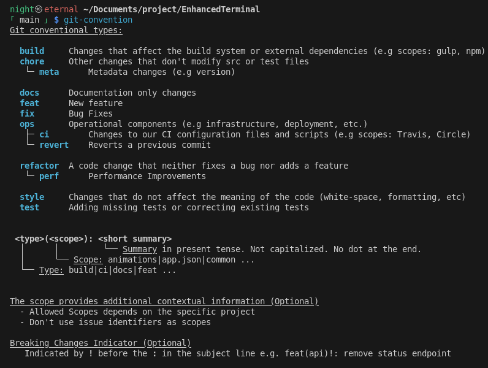
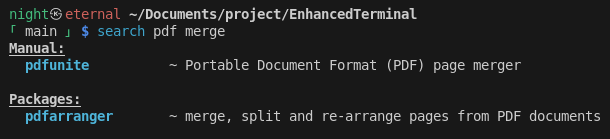
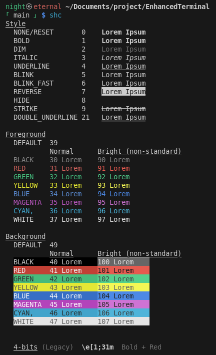
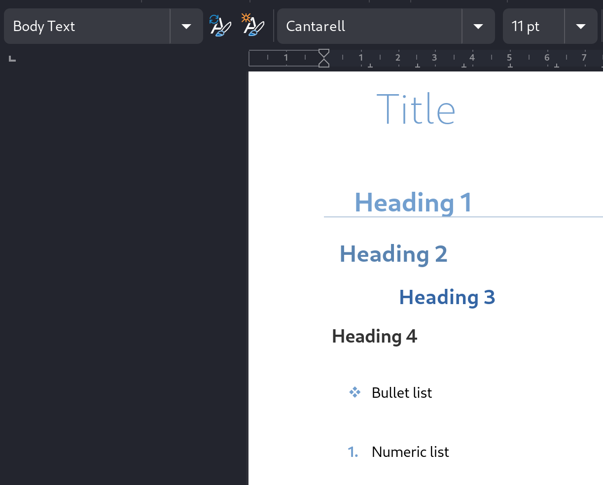
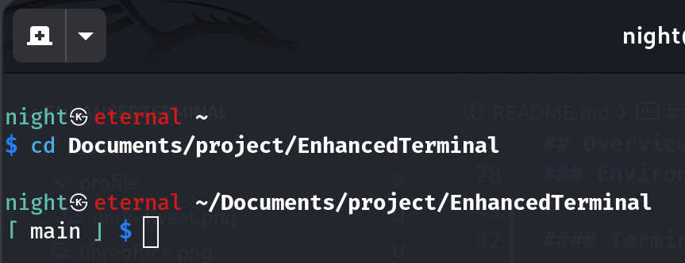
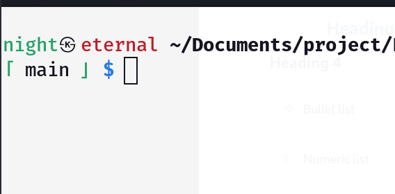
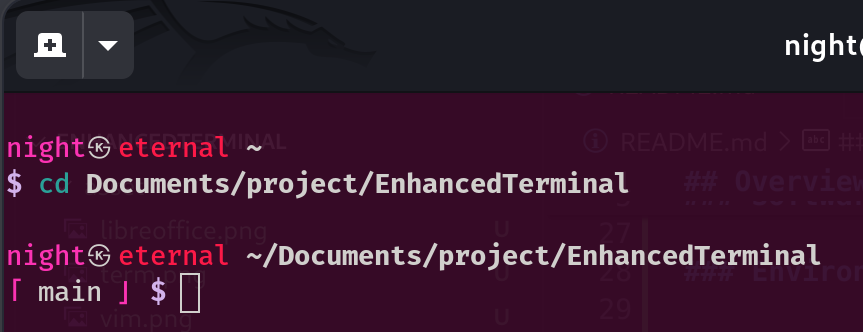
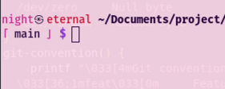
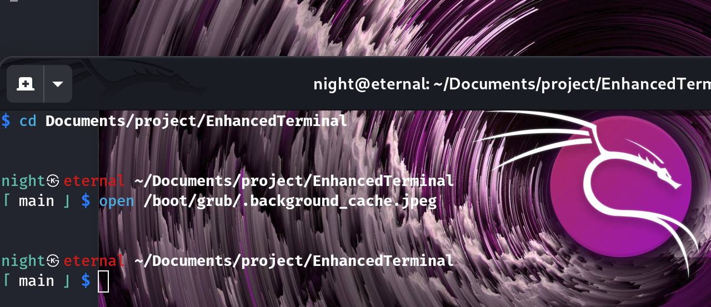
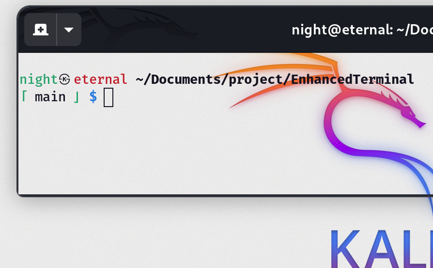

# Nebula 🌕

## Overview

This project aims to setup a convenient environment.

[Softwares](#software-installed)
- [LibreOffice Template](#libreoffice-template)
- [Terminal Profiles](#terminal-profiles)
- [ZSH aliases](#zsh-aliases)
	- [Node](#node)
	- [Git](#git)
	- [Security](#security)
- [VSCode Keyboard Shortcuts](#vscode-keyboard-shortcuts)
- [Additional Fonts](#additional-fonts)
- [Gnome Settings](#gnome-settings)

## Environment

| | | |
|-|-|-|
| Distro | Debian-like | **Required** |
| Terminal | ZSH | **Required** |
| Desktop Environment | GNOME *or* KDE | *Prefered* |

## Install

### Full install
```sh
chmod +x import.sh
./import.sh --setup
```

### Update
```sh
chmod +x import.sh
./import.sh --update
```

### Help

```
Usage: ./import.sh { --setup | --setup-no-gui }

Full install:
    --setup          Setup environment
    --setup-no-gui   Setup environment without graphical UI

Update:
  -a  --all          Import everything
  -u  --update       alias for -a

Unique:
  -c  --code         Setup VSCode
  -d  --docker       Setup rootless Docker
  -g  --git          Setup git
  -n  --node         Setup Node.js
  -o  --office       Setup LibreOffice
  -s  --soft         Setup entertainment and convenient softwares
                       (Spotify, Telegram, WhatsDesk, Discord, Gnome settings)

Note: Setup means install and configure
```

## Update
Once installed, check whenever you want an update :
```sh
update-zsh
```

## Software installed

- Development
  - VS Code
  - NVM, Node.js & npm

- Work software
  - GIMP
  - LibreOffice (with gnome extension)

- Convenience Software
  - VLC
  - Spotify
  - WhatsDesk (unofficial WhatsApp UI)
  - Telegram
  - Discord
  - Bluetooth & Blueman

- Utils
  - qBittorrent
  - PDF tools
  - Snap package manager
  - Hex editor
  - Vim

## Preview - Frequently Asked Questions

### Git convention

### Search within manual and/or packages

### Shell colours

## LibreOffice Template



| Element | Size (pt) | Color | Left padding (cm) | Other style |
|---|---|---|---|---|
| **Title** | 32 | Light Blue 2 | 1.4 | Font: Cantarell Light |
| **Heading 1** | 20 | Light Blue 2 | 0.8 (Border) | Border: Bottom 0.05pt, Light Blue 3 |
| **Heading 2** | 18 | Light Blue 1 | 0.4 |  |
| **Heading 3** | 16 | Dark Blue 1 | 2.0 |  |
| **Heading 4** | 14 | Dark Gray 2 | 0.2 |  |

## Terminal Profiles

| Dark Profile | Rendering | Light Profile | Rendering |
|---|---|---|---|
| **Dark** |  | **Light** |  |
| **Dark Sweet** |  | **Light Sweet** |  |
| **Dark Transparent** |  | **Light Transparent** |  |

## ZSH aliases

### Node
| Command | Description |
|---|---|
| `nclean` | Remove all `node_modules` folders |
| `npi` *or* `npmi` | `npm install` |
| `npu` *or* `npmu` | `npm uninstall` |
| `npr` *or* `npmr` | `npm run` |
| `ntree` | List project files |
| `start` | `npm start` |

### Git
| Command | Description |
|---|---|
| `ga` | `git add` |
| `gco` | `git commit -m` |
| `gch` | `git checkout` |
| `gcl[l]` | `git clone`, if `l` appended then `cd` into directory if  |
| `gd` *or* `gdiff` | `git diff` |
| `glog` | `git log` |
| `gp` | `git push` |
| `gpdev` | `git push -u origin dev` |
| `gpdevmain` | `git push -u origin dev:main` |
| `gpmain` | `git push -u origin main` |
| `gstat` | `git status` |
| `gsw` | `git switch` |
| `pull` | `git pull` |
| `push <comment> <file> ...` | All in one |

### Docker
| Command | Alias | Description |
|---|---|---|
| `dbuild` | `docker build` |
| `dbtag` | `docker build . -t dbtag` |
| `dcls` | `docker container ls` |
| `dc` | `docker compose` |
| `dcdefault` | `docker compose -f compose.yml up` |
| `dcdev` | `docker compose -f compose.development.yml up` |
| `dctest` | `docker compose -f compose.test.yml up` |
| `dps[s]` *or* `dls` | `docker ps`, + size if `s` appended |
| `drun` | `docker run -t` |

### Modified
| Command | Description |
|---|---|
| `curl` | Show progress by default |
| `[s]dd` | `dd status=progress`, if `s` prepended then execute as `sudo` |
| `objdump` | Intel format with syntax color |
| `rsync` | `rsync -ah --info=progress2` |

### Finding & Listing
| Command | Description |
|---|---|
| `iagrep <args...>` | Insensitive AND grep |
| `ll` / `la` | `ls -l` / `ls -lA` |
| `lb` | List programs |
| `lc` | Last exit code |
| `le` | List env files |
| `lss [<path>] [<depth>]` | List files by size descending order |
| `[i][w]lookup` | Search a text within all files including subfolders of the current directory. Prepend `i` for insensitive, `w` for word match (faster) |
| `[a\|m]search <text>` | Search a text within manual and/or available packages |

### Displaying
| Command | Description |
|---|---|
| `cah` | Print file content highlighted according to format |
| `logan` | Analyze log file |
| `original` | Get alias definition |

### Managing
| Command | Description |
|---|---|
| `adbpush` | Push file to Emulator's picture (Android Studio) |
| `layout` | Show keyboard layout |
| `resize <height>x<width> <in> <out>` | Resize image |
| `schown <path>` | Change user and group ownerschip to current user |

### Hash
| Command | Description |
|---|---|
| `blake2b512sum` | [BLAKE2b-512](https://www.blake2.net/) |
| `blake2s256sum` | [BLAKE2s-256](https://www.blake2.net/) |
| `keccak256sum` | [Keccak-256](https://keccak.team/keccak.html) |
| `sha3-256sum` | [SHA3-256](https://keccak.team/keccak.html) |
| `shake256sum` | [SHAKE-256](https://nvlpubs.nist.gov/nistpubs/FIPS/NIST.FIPS.202.pdf) |
| `ssh-fingerprints [<signature>] [<hash>]` | Show SSH fingerprints |

### Security
| Command | Description | Note |
|---|---|---|
| `expand-url <url>` | Expand a shorten URL | Do NOT perform the redirect ✅ |
| `shred-folder [options] <folder>` | Shred folder | See `man shred` for more information |
| `vpn-exception { add \| del \| reset \| get } { <IPv4> \| <domain> }` | Manage VPN exceptions | Actually manage routes. See `ip route` for details |
| `watermark <file\|directory>` | Watermark an image, or all images in a directory (including sub-directories) | |

### Help
| Command | Description |
|---|---|
| `gitc` *or* `git-convention` | Display help about git convention |
| `help [<text>]` | Display a help. If an argument is given call `search <text>` |
| `help-recovery` | Display a help intended for recovery |
| `shc` *or* `shell-colour` | Display help about shell colours |

### VSCode Keyboard Shortcuts
| Key | Command |
|---|---|
| `²` | Toggle Line Comment |
| `ctrl` + `²` | Toggle Line Comment |
| `ctrl` + `W` | Rename File |
| `ctrl` + `Q` | Do NOT close VSCode |

### Additional Fonts

* Inter
* Lato
* Open Sans
* Poppins
* Roboto
* Ubuntu

### Gnome Keyboard Shortcuts

| Key | Command |
|---|---|
| `F1` | Volume mute |
| `F2` | Volume down |
| `F3` | Volume up |
| `shift` + `Print` | Screen capture |
| `ctrl` + `Print` | Window Screen capture |
| `shift` + `ctrl` + `Print` | Screen recorder |

#### Mini keyboard layout shortcuts

| Key | Command |
|---|---|
| `F9` | Full screen capture |
| `shift` + `F9` | Screen capture |
| `ctrl` + `F9` | Window Screen capture |
| `shift` + `ctrl` + `F9` | Screen recorder |
